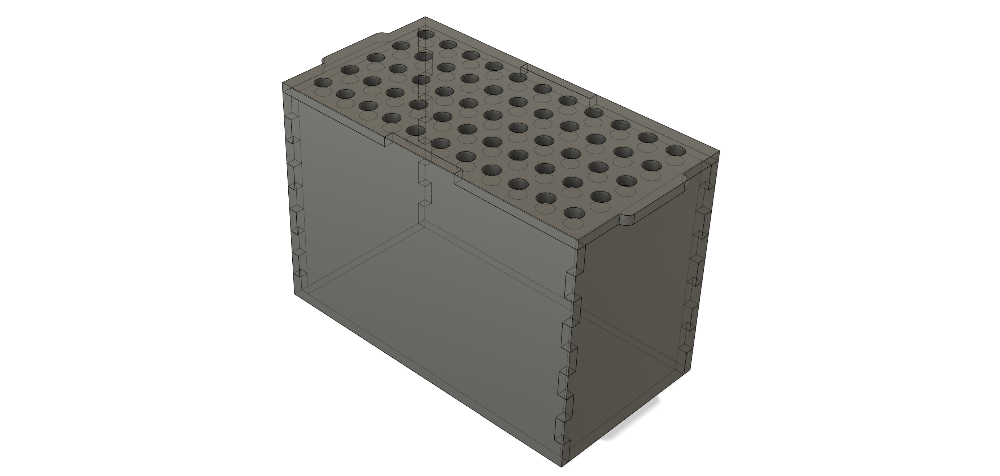
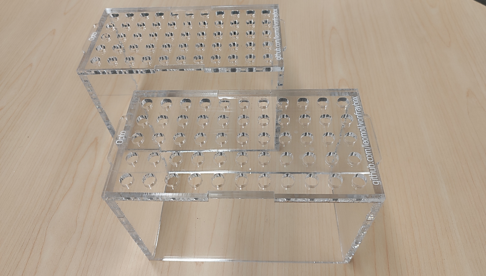

# Von Frey Box

Box for the Von Frey nociception test.

## Dimensions
-	Internal dimensions: 100 x 200 x 140 cm

## Components
- [6mm opaque white acrylic sheets](https://www.polymershapes.com/product/acrylic/)

## Assembly instructions
- Laser cut the acrylic sheets using the [provided CAD drawings](CAD). Remove protective film.
- Assemble all acrylic parts using painter's tape and apply acrylic cement. Remove painter's tape after drying.

## Version History
### 0.0.1
* 2024-09-27
  - Initial Release.

## License
© 2022 [Leonardo Molina][Leonardo Molina]

This project is licensed under the [Creative Commons BY-NC-SA 4.0 License](https://creativecommons.org/licenses/by-nc-sa/4.0/).

[Leonardo Molina]: https://github.com/leomol
[LICENSE.md]: LICENSE.md